# Hydrogen V1

> *A CR2032-powered keychain clock, minimalist, open hardware, and built to last.*


 


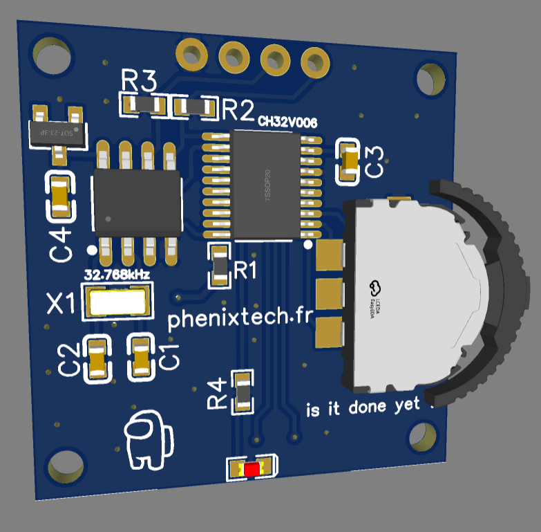 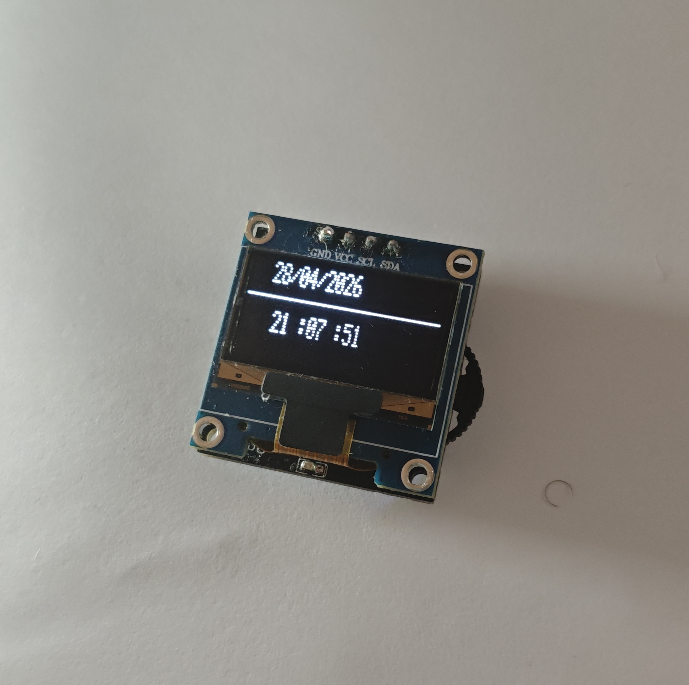 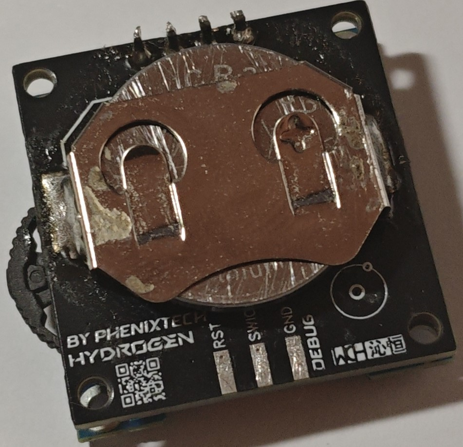 

---


## Overview


**Hydrogen V1** is a coin-cell (CR2032) powered keychain clock designed around aggressive power optimization and a minimal BOM. It wakes on button press, displays the time on an SSD1306 OLED for 3 seconds, then returns to deep sleep, targeting a **~6-month battery life** on a single CR2032.

This is the first device in the **Hydrogen** line, part of the broader [PhenixTech](https://phenixtech.fr) hardware project ecosystem.

---

## Menu / On-Device Tools
 
Beyond the default clock screen, Hydrogen has a menu navigated via the 3-way thumbwheel:
 
- **Time / Clock** - set full RTC date and time (year included); flags invalid RTC state and guides you into setup

  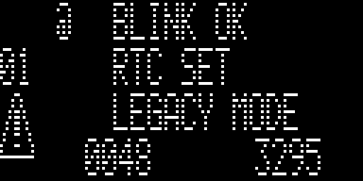


- **Calendar** - simple calendar view

  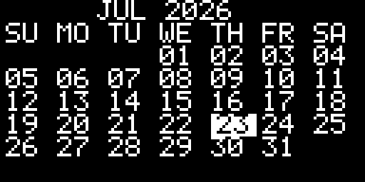
  
- **Stopwatch** - stopwatch mode

  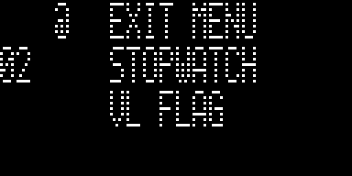

- **Battery** - battery voltage, with low/critical warnings on startup

    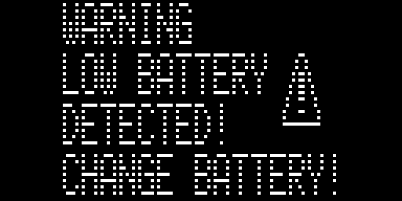

- **About** - credit, firmware compile date/time as a version marker
  
   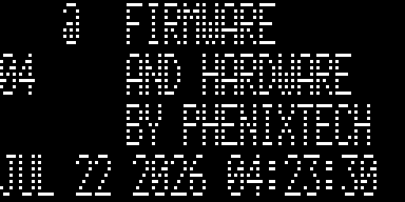

Also supports alternate watch-face bitmaps, themes, and 2 display modes:

| Regular | Legacy |
|---|---|
| 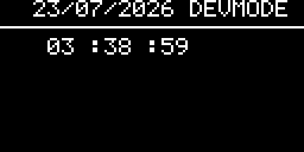 | 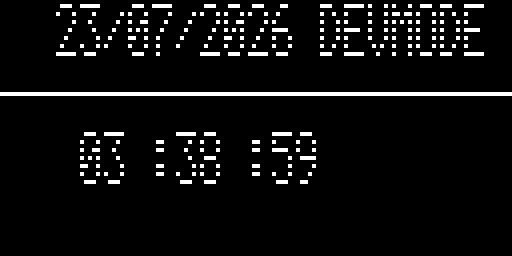 |
> Legacy mode is a happy accident: an early firmware bug set the display init to 128x32 instead of 128x64, giving it a distinct stretched-out, scan-line look. Kept around for the aesthetic, though it'll eventually be phased out.

---

## Hardware

### Block Diagram

```
CR2032
  │
  ├──[BAT54 Schottky]──► VBAT (backup)
  │        │
  │        └── [22µF holdover cap]──► PCF8563T VBAT
  │
  └──► CH32V006
          │
          ├── I²C ──► PCF8563T RTC ──► 3215 32.768kHz crystal
          ├── I²C ──► SSD1306 OLED (daughter board)
          ├── GPIO ──► LED (3kΩ, ~500uA, low-battery indicator)
          └── SWIO/RST pads (debug header)
```

### Bill of Materials

| Component | Part | Package | Unit Cost |
|---|---|---|---|
| MCU | CH32V006F8P6 | TSSOP20 | €0.165 |
| RTC | PCF8563 | SOP8 | €0.155 |
| Crystal | 32.768kHz SMD | 3215 | €0.101 |
| Schottky | BAT54 | SOD-23 | €0.012 |
| OLED | 128x64 OLED | TH | €0.539 |
| LED | Red, 0603 | 0603 | €0.007 |
| Nav | 3-way thumbwheel | SMD | €0.057 |
| Battery holder | CR2032 holder | SMD | €0.09 |
| PCB | JLCPCB fabrication | N/A | €0.748 |
| Passives | resistors, caps, etc. | SMD | ~€0.01 |
| **Total** | | | **~€1.87** |

### Key Design Decisions

- **CR2032 power source**: cheap, high capacity at low loads.

  The CR2032, also known as the coin cell battery, was chosen because it's cheap and available (€0.89 for 6 cells, so ~14 cents each), thin (3.2mm), and has a high capacity (225mAh vs 40mAh for a rechargeable cell of the same dimensions). It's not the perfect source though, high internal resistance makes the voltage sag a lot under load. I selected components with a low minimum operating voltage to work around this.

- **CH32V006**: sub-20-cent controller.

  This microcontroller by WCH features a 48MHz clock, 8KB of SRAM, and an impressive 62KB of flash. It's powerful enough to run the display with no issue, and has enough flash to store all my bitmaps and code. It also runs down to 2V and draws only ~4mA on its own (the full active current including the display is higher, see Power Budget below). All for the cost of 16 cents per unit, much cheaper than STM32, RP2040, or ESP32.

- **Two-PCB approach**: main board + SSD1306 module daughter board with a 4-pin header.

  This is a cost-saving feature that also simplifies the board (a 4-pin through-hole header instead of a 30-pin SMD connector). V2 will integrate a bare OLED panel on a single PCB to make the device thinner, more reliable (the 4-pin header is a failure point under stress), and more power-efficient.

- **BAT54 Schottky + 22µF holdover cap**: keep time during battery swaps.

  This lets the RTC retain its time and date during a battery swap, the battery can be removed for up to 2 minutes before time resets. Note: while running on the holdover cap, time may drift a few seconds.

- **Debug interface**: three pads (SWIO, GND, RST) on a 2.54mm pitch for WCH-LinkE programming.

  To program Hydrogen V1, just place 3 headers on the debug pads, pogo pins work even better, since headers cause more wear on the pads over repeated use.

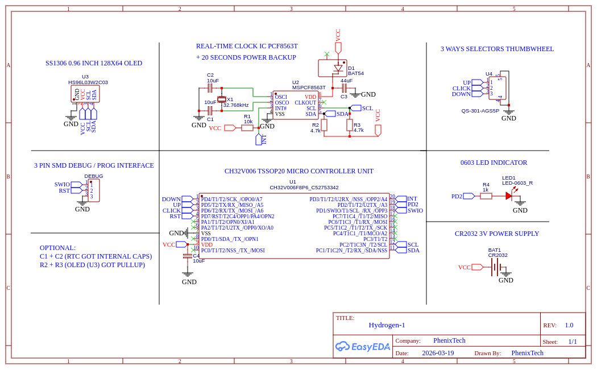

---

## Firmware

> Developed with the WCH SDK / MounRiver Studio II

The firmware is in C, and regularly updated. Fixing issues, reducing sleep power consumption, or adding new features. 


### Sleep / Wake Behavior

Getting deep-sleep current down to ~60µA required manually shutting down peripherals before entering standby, rather than relying on defaults:

**Entering sleep** (`Enter_Standby`):
- OLED is turned off and the I²C bus is stopped
- ADC is disabled, along with its peripheral clock
- MCU enters standby via `PWR_EnterSTANDBYMode(WFE)`, woken by an EXTI (interrupt) button event

**Waking up**:
- Execution resumes right after the standby call
- The button hold duration is measured; a long press re-initializes I²C and the ADC, turns the OLED back on, and forces a display refresh
- the current time is read and drawn; the RTC's VL (voltage-low) flag is checked and a warning shown if set
- Battery level is checked and a low-battery warning triggered if needed
- A short blink pattern confirms a successful wake

### Power Budget

| State | Current | Duration |
|---|---|---|
| Deep sleep (MCU + RTC) | 60uA | ~99% of time |
| Active (OLED on, MCU running) | 8mA | 3s per wake |
| LED flash (low-battery) | ~500uA | brief pulse |

*Estimated battery life: **~6 months** on a standard CR2032 (225mAh).*
---

## PCB

Designed in **EasyEDA**, fabricated by **JLCPCB**, components sourced from **Aliexpress**.

- 2-layer PCB, 1.6mm thickness
- SMD components on top side; CR2032 holder on bottom
- Compact form factor for keychain use (about 28x28mm)
- Two-board stack: main board + OLED module daughter board

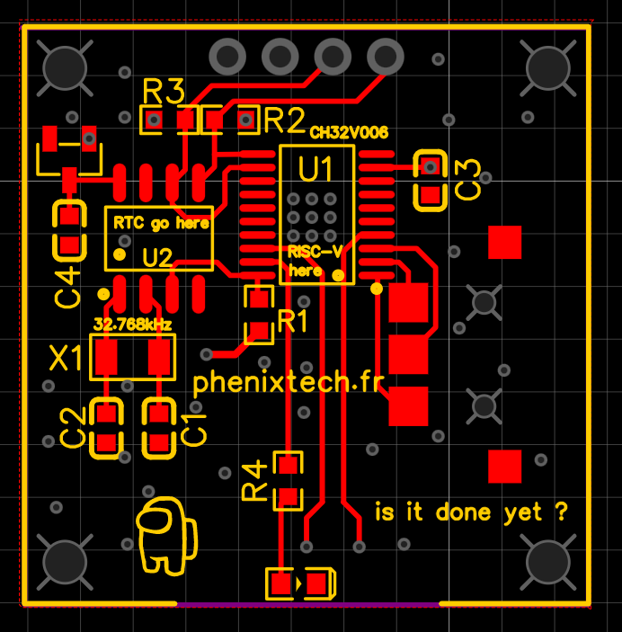 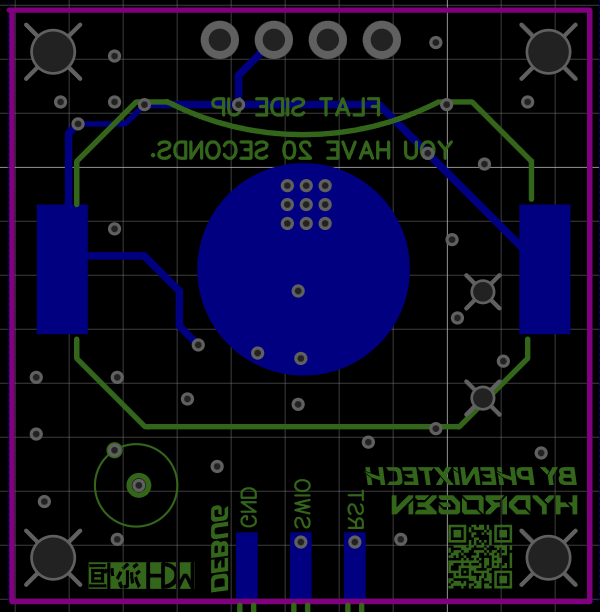 

---

## Roadmap


**V1** - Finished - Two-board stack, SSD1306 module, current version

**V2** - In Developement - Single PCB, bare OLED via FPC, optimized layout, extra battery life, and more ! Out before 2027.

---

## Project Naming

Hydrogen is part of my own hardware ecosystem, where projects are named after elements and subatomic particles:

Hydrogen being the lightest element, it is one of my simplest, most efficient projects.

**See also :**

- **Boron** - Credit card sized, my main handheld device line (RP2350, full color display)

---

## License

This project is licensed under **GPLv3**, with one exception:

Files under `/Software/User` are GPLv3, **except** for the following, which originate from Nanjing Qinheng Microelectronics Co., Ltd. (WCH) and retain their original copyright and terms as noted in their file headers:
- `CH32v00X_it.c`
- `CH32v00X_it.h`
- `CH32v00X_conf.h`
- `system_ch32v00X.c`
- `system_ch32v00X.h`

Modified versions must include a reference to the original project: https://github.com/PhenixTech/Hydrogen
